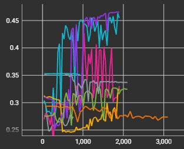
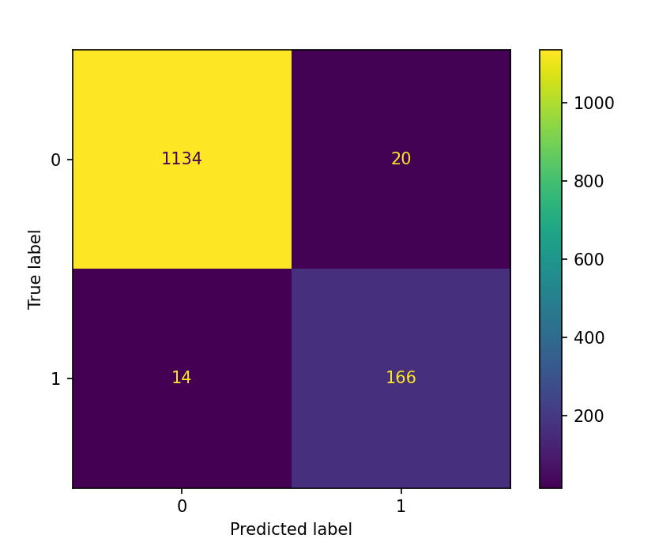

# Incident Prediction

## Dataset Generation
A custom time-series dataset was synthesized to train and evaluate the predictive models. The base signal consists of a sine wave combined with Gaussian noise. Incidents are introduced at intervals drawn from an exponential distribution. Each incident is preceded by a pre-incident phase, modeled with an exponential curve, and culminates in a sudden amplitude increase. The specific timeframe where the amplitude is artificially raised by 0.2 is labeled as the incident (class 1), while the rest remains normal (class 0).

## Methodology & Models

### 1. Long Short-Term Memory (LSTM)
An LSTM neural network was initially selected due to its standard application in time-series analysis and forecasting. However, the results were unsatisfactory. 

As observed in the TensorBoard logs, the ROC AUC score fluctuated between 0.2 and 0.5. A score of 0.5 represents a random guess, and values closer to 0.2 indicate that the model was completely unable to learn the temporal dependencies.

### 2. Gradient Boosting Classifier (GBC)
Following the LSTM's poor performance, the approach was changed to a Gradient Boosting Classifier using the `scikit-learn` library. GBC builds an ensemble of decision trees sequentially, where each new tree attempts to correct the errors made by the previous ones, eventually creating a highly accurate strong learner. This algorithm achieved much better ROC AUC score of 0.95. The confusion matrix of the model is presented below:

## Evaluation Metrics
To assess model performance, the following metrics were utilized:
* **ROC AUC Score:** Evaluates the model's overall ability to distinguish between the normal state and an upcoming incident across all possible classification thresholds.
* **Confusion Matrix:** Provides a detailed breakdown of predictions, illustrating the exact ratio of true positives, false positives, true negatives, and false negatives.

## Analysis of Results
The GBC model significantly outperformed the LSTM approach, achieving a high ROC AUC of 0.95. While the LSTM failed to learn the data patterns, the GBC easily recognized the pre-incident signals to accurately classify the events.